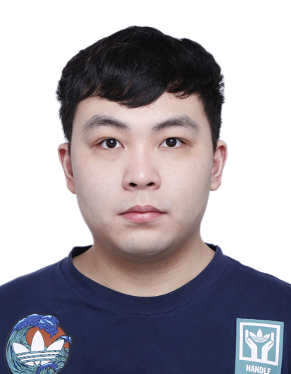

# WenTian's User Page

**This is my user page which include content that introduces me as a programmer and as a person**

```
Personal description
```

## Me as a Programmer:

> I have been studying programming language for 3 years in college. During past 3 years, I learnt java, python, c, c++, system verilog, assembly and vhdl and spent a lot of time outside of class practicing them. Furthermore, I did an software engineering internship last summer in DongHua softerware in China, JiangXi, NanChang. As a conclusion, my career as a programmer just started.

## Me as a Person:

> Current ucsd undergraduate computer engineering major student with senior standard. Super nerd who loves computer hardware/software, started self learning computer language/architecture/technologies in primary school, built up first personal computer in the third grade. Interested in learning new technologies, tools and gathering working experience at the beginning of my career(especially some computer hardware). Dream is to design my own computer micro‐chip architecture.

Unordered List of Language:

- python
- c++
- java

Ordered List of Language:

1. java
2. python
3. c++

[Link to README file](README.md)

My personal web page [Web Page](https://sites.google.com/ucsd.edu/w3tian).

[To me as programmer](https://wen-tian-pineapple.github.io/GitHub-Pages-project/#me-as-a-programmer) 

- [x] Finish my changes
- [x] Push my commits to GitHub
- [x] Submitted
